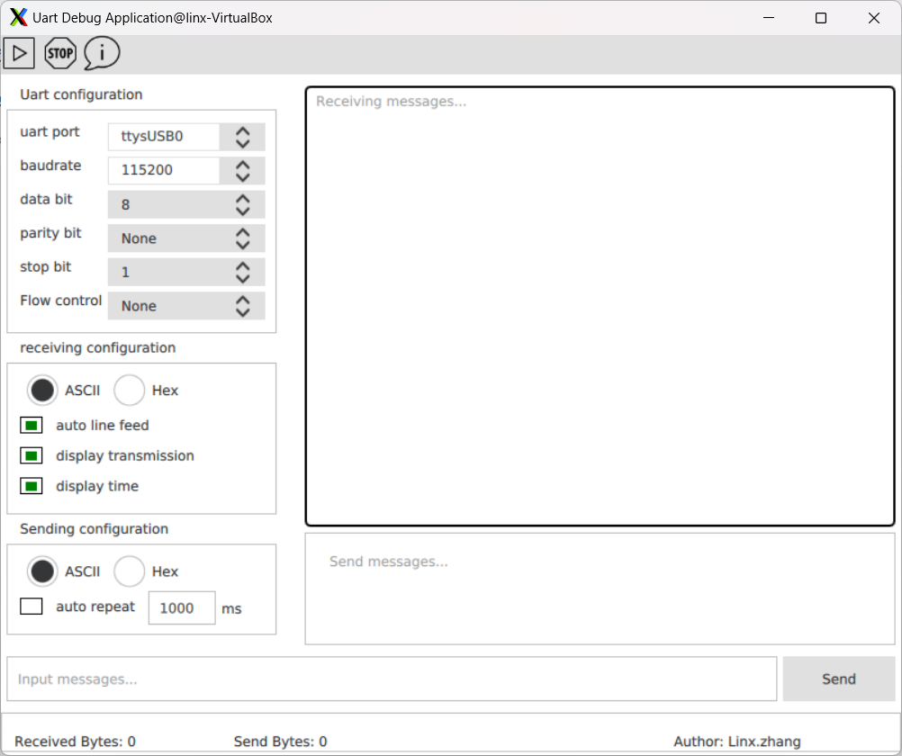

# UART
嵌入式平台使用QT5开发UART， QML开发UI， 支持多种波特率通信。

## Getting Started
在Linux系统使用qtcreator工具打开uart.pro工程文件， 直接点击编译按钮即可。

### How to build

编译步骤：
1. sudo apt install build-essential qt5-default qtcreator
2. start qtcreator IDE and open uart.pro project file.
3. click run form qtcreator IDE.

### How to Run

在Linux命令行执行：./uart

## Authors

Linx.zhang

## License

This project is licensed under the MIT License - see the [LICENSE.md] file for details.
